2026年03月11日

共收录 60 篇最新研究

**📌 阅读指南**

本期收录 60
篇生态与环境领域最新研究，按主题分类整理，提供标题、摘要与解读点评，方便快速浏览和筛选感兴趣的方向，点击链接可查看原文。

检索范围：Nature、Science、PNAS 及生态环境领域主要期刊（含 Nature
子刊、Global Change Biology、Ecology Letters
等），涵盖生态学、环境科学、气候变化、保护生物学、植物与农业科学等方向，收录日期为
2026 年 2–3 月近期发表或在线优先出版的文章。

**各领域篇数一览：**

🌡 气候变化（7篇）　🔬 环境科学与技术（13篇）　🌲
森林与陆地生态（4篇）　🌊 海洋与水生态（9篇）

🌱 植物与农业（9篇）　🐾 保护与生物多样性（4篇）　🪨
土壤与地球科学（8篇）　🧬 进化与动物生态（6篇）

# 📑 目录

**  
【气候变化】**

1.  Additionality requirements of carbon markets could penalize
    Indigenous stewardship*  
    碳市场的额外性要求可能惩罚原住民的土地管护* \[Nature Climate
    Change\]

2.  Breaking the language barrier in adaptation*  
    打破适应中的语言障碍* \[Nature Climate Change\]

3.  Antarctic minerals in a warming world*  
    变暖世界中的南极矿产* \[Nature Climate Change\]

4.  Severe winter storms bring severe population changes*  
    严重冬季风暴带来严重的种群变化* \[Nature Ecology & Evolution\]

5.  Drained Agricultural Peatlands as Persistent Carbon Sources:
    Implications for Carbon and Water Use Intensity in Food
    Production*  
    排水农业泥炭地作为持续碳源：对粮食生产碳和水利用强度的影响* \[Global
    Change Biology\]

6.  Congo’s largest humic lakes emit ancient peat carbon*  
    刚果最大的腐殖湖排放古老的泥炭碳* \[Nature Geoscience\]

7.  Nonlinear increase of compound drought-heatwave events since the
    early 2000s*  
    自21世纪初复合干旱-热浪事件的非线性增加* \[Science Advances\]

**  
【环境科学与技术】**

8.  Nuclear fuel from saline waters*  
    从盐水中提取核燃料* \[Nature Sustainability\]

9.  Compostable soft robots for plant monitoring*  
    用于植物监测的可堆肥软体机器人* \[Nature Sustainability\]

10. Reconstitution of woody biomass framework via dual-functional lignin
    engineering toward efficient and salt-resistant solar
    desalination*  
    通过双功能木质素工程重构木质生物质框架实现高效抗盐太阳能海水淡化*
    \[Nature Communications\]

11. \[ASAP\] DNAPL-Responsive Hydrogel Nanoreactor Encapsulating nZVI
    for Enhanced Degradation of Chlorinated Contaminants in
    Groundwater*  
    DNAPL响应性水凝胶纳米反应器包裹nZVI用于增强地下水氯代污染物降解*
    \[Environ. Sci. Technol.\]

12. \[ASAP\] Can Benchmarking Increase the Accuracy of Predicting
    Biodegradation Rates across Aquatic Ecosystems?*  
    基准测试能否提高跨水生生态系统生物降解速率预测的准确性* \[Environ.
    Sci. Technol.\]

13. Molecular oxygen cascade reduction to •OH via coplanar
    dual-electrocatalytic zone achieving electrolyte-free water
    purification*  
    分子氧通过共面双电催化区级联还原生成羟基自由基实现无电解质水净化*
    \[Nature Water\]

14. Waste per- and polyfluoroalkyl substance-assisted flash fluorination
    for lithium recovery from brine*  
    废弃全氟和多氟烷基物质辅助闪速氟化用于卤水锂回收* \[Nature Water\]

15. Rewiring energy flow in biohybrids for enhanced solar-driven
    biosynthesis*  
    重塑生物杂交体中的能量流以增强太阳能驱动生物合成* \[Nature
    Sustainability\]

16. In situ degradation of biodegradable bio-based plastics in urban
    soil: Pilot study for PLA, PHB, PHBH, and Bio-PBS in central Tokyo,
    Japan*  
    东京市中心城市土壤中生物基可降解塑料的原位降解试点研究* \[Sci. Total
    Environ.\]

17. Potential One Health risk of downwind exposure to airborne pathogens
    from thawing Siberian permafrost*  
    西伯利亚永久冻土融化释放的空气传播病原体对下风向地区的潜在健康风险*
    \[Environ. Res. Lett.\]

18. Alcohol group migration by proximity-enhanced H atom abstraction*  
    通过临近增强的H原子抽取实现醇基团迁移* \[Nature\]

19. In situ synchrotron X-ray scattering reveals organic-mediated
    scaling mechanisms on desalination membranes*  
    原位同步辐射X射线散射揭示海水淡化膜上有机物介导的结垢机制* \[Nature
    Communications\]

20. \[ASAP\] Liquid Biofuels for Transportation: Lessons of the Last Two
    Decades for the Next Two*  
    交通运输用液体生物燃料：过去二十年的教训与未来二十年的展望*
    \[Environ. Sci. Technol.\]

**  
【森林与陆地生态】**

21. Climate change will increase forest disturbances in Europe
    throughout the 21st century*  
    气候变化将在整个21世纪增加欧洲森林干扰* \[Science\]

22. Influences of Structural and Species Diversity on Forest Resistance
    to Drought*  
    结构和物种多样性对森林抗旱性的影响* \[Ecology Letters\]

23. Effects of Ungulate Herbivores on Temperate Forest Understory
    Vegetation—Implications From a Large‐Scale Wildlife Exclosure
    Experiment in Central Europe*  
    有蹄类食草动物对温带森林林下植被的影响——来自中欧大规模野生动物围栏实验的启示*
    \[J. Veg. Sci.\]

24. Forest Heterogeneity by Chain Saw: How Between‐Patch Variation in
    Old Growth Attributes Changes the Metacommunities of Beetles*  
    森林异质性与链锯：老龄林斑块间属性变化如何改变甲虫的元群落*
    \[Ecology Letters\]

**  
【海洋与水生态】**

25. Global Marine Fishery Stock Productivity Under Climate Change*  
    气候变化下全球海洋渔业资源生产力研究* \[Global Change Biology\]

26. Range-edge effects of marine heatwaves*  
    海洋热浪的分布边缘效应* \[Nature Ecology & Evolution\]

27. Diversity and ecology of the prokaryotic microbiome associated with
    marine sponges across Antarctica*  
    南极洲海绵相关原核微生物组的多样性和生态学* \[Sci. Total Environ.\]

28. Emma Johnston (1973–2025)*  
    Emma Johnston (1973-2025)* \[Nature Ecology & Evolution\]

29. A novel kleptoplastidic symbiosis revealed in the marine centrohelid
    Meringosphaera with evidence of genetic integration*  
    海洋中心鞭毛虫中发现新型盗食质体共生关系及遗传整合证据* \[Current
    Biology\]

30. Anaemic Streams: Iron and Essential Trace Metals Frequently Limit
    Primary Producer Biomass*  
    贫血的溪流：铁和必需微量金属经常限制初级生产者生物量* \[Ecology
    Letters\]

31. Water scientists must become agenda-setters*  
    水科学家必须成为议程制定者* \[Nature Water\]

32. Meta analysis of Manning's coefficient for saltmarsh and mangroves
    to support broad scale assessment*  
    盐沼和红树林曼宁系数的元分析以支持大尺度评估* \[Estuar. Coast. Shelf
    Sci.\]

33. Monitoring coastal shoreline change using PlanetScope imagery*  
    使用PlanetScope影像监测海岸线变化* \[Estuar. Coast. Shelf Sci.\]

**  
【植物与农业】**

34. Amazon rainforests are rejuvenating their canopies by producing more
    photosynthetically efficient young leaves under climate change*  
    亚马逊雨林在气候变化下通过产生更多光合效率高的嫩叶来更新其冠层*
    \[Nature Plants\]

35. Plant Community Responses to Long‐Term Nutrient Additions Interact
    With Elevation and Vegetation Type in a Subarctic Tundra*  
    亚北极苔原中植物群落对长期养分添加的响应与海拔和植被类型的交互作用*
    \[J. Veg. Sci.\]

36. Implementation of practices shapes the effectiveness of agricultural
    diversification for arthropod related ecosystem services: a
    meta-analysis*  
    实施方式塑造农业多样化对节肢动物生态系统服务的有效性：一项元分析*
    \[Agron. Sustain. Dev.\]

37. Grain zinc, iron and protein concentrations of contemporary wheat
    cultivars fall short of targets for human health*  
    现代小麦品种的籽粒锌、铁和蛋白质浓度低于人类健康目标* \[Nature
    Food\]

38. An NLR–transposase fusion gene from rye provides broadly effective
    resistance to stripe rust in wheat*  
    来自黑麦的NLR-转座酶融合基因为小麦提供广谱条锈病抗性* \[Nature
    Plants\]

39. A framework for estimating manure nitrogen balance and recycling
    potential for current and future conditions in the USA*  
    美国当前和未来条件下畜禽粪便氮平衡和循环潜力评估框架* \[Nature
    Food\]

40. Nanodomain-localized formin gates symbiotic microbial entry in
    legume and solanaceous plants*  
    纳米域定位的成形蛋白门控豆科和茄科植物的共生微生物入侵* \[Science\]

41. Resurrecting the American chestnut*  
    复活美国栗树* \[Nature Plants\]

42. Localized thresholds for smarter crop risk management*  
    局地化阈值实现更智能的作物风险管理* \[Nature Food\]

**  
【保护与生物多样性】**

43. Perceived costs as drivers of wildlife management preferences in
    rural Tanzanian communities*  
    感知成本作为坦桑尼亚农村社区野生动物管理偏好的驱动因素*
    \[Conservation Biology\]

44. Scenarios and strategies for future‐proofing ecosystem management
    under climatic novelty*  
    气候新颖性下未来保护生态系统管理的情景与策略* \[Conservation
    Biology\]

45. Live parrots were carried across the Andes before the Incas’ rise*  
    印加帝国崛起前活鹦鹉曾被携带穿越安第斯山脉* \[Nature\]

46. Defining and identifying relevant stakeholders to advance effective
    conservation*  
    定义和识别相关利益相关者以推进有效保护* \[Conservation Biology\]

**  
【土壤与地球科学】**

47. Detection of dietary stress and geophagic behaviour forced by dry
    seasons in Miocene Gomphotherium*  
    中新世嵌齿象因干旱季节引发的饮食压力和食土行为检测*
    \[Biogeosciences\]

48. Evaluating glycerol dialkyl glycerol tetraether (GDGT)-based
    reconstructions from varved lake sediments during the Holocene*  
    评估全新世湖泊纹层沉积物中基于GDGT的古气候重建* \[Biogeosciences\]

49. Species-specific differential dissolution morphology of selected
    coccolithophore species: an experimental study*  
    颗石藻物种特异性差异溶解形态学：一项实验研究* \[Biogeosciences\]

50. Profile of Emily E. Brodsky*  
    Emily E. Brodsky人物简介* \[PNAS\]

51. Effects of correlated collisions and intermittency on the growth of
    lucky droplets*  
    相关碰撞和间歇性对幸运液滴生长的影响* \[PNAS\]

52. Microbial dispersal from a hyperactive sandsheet in the Icelandic
    Highland*  
    来自冰岛高地活跃沙席的微生物扩散* \[Sci. Total Environ.\]

53. Generation of inner core anisotropy by anisotropic thermal
    conductivity of iron crystals*  
    铁晶体各向异性热导率产生内核各向异性* \[Nature Geoscience\]

54. Mantle oxidation influenced by reduction-oxidation budget of
    Mariana-type subduction zones*  
    马里亚纳型俯冲带的氧化还原收支影响地幔氧化* \[Nature Geoscience\]

**  
【进化与动物生态】**

55. Time-dependent adaptations of damaged neurons and their
    microenvironment in the regenerating adult zebrafish spinal cord*  
    成年斑马鱼脊髓再生中受损神经元及其微环境的时序适应* \[Science
    Advances\]

56. Cis-regulatory evolution reveals sensory trade-offs as a genetic
    basis for temporal niche evolution in tapirs*  
    貘的顺式调控进化揭示感官权衡是时间生态位进化的遗传基础* \[Science
    Advances\]

57. Uniqueness and predictability in evolution and the history of
    mollusks*  
    软体动物进化和历史中的独特性与可预测性* \[PNAS\]

58. Repeated convergent evolution of bradykinin mimics as defensive
    toxins*  
    缓激肽模拟物作为防御毒素的反复趋同进化* \[Science\]

59. Could flies sniff out contraband chemicals?*  
    果蝇能否嗅出违禁化学品* \[Nature\]

60. The role of amygdala GABA neurons in controlling stress and
    reproduction in female mice*  
    杏仁核GABA神经元在调控雌性小鼠应激和繁殖中的作用* \[Nature
    Communications\]

# 【气候变化】

## 1. Additionality requirements of carbon markets could penalize Indigenous stewardship

*（碳市场的额外性要求可能惩罚原住民的土地管护）*

**📰 Nature Climate Change** \| 2026-03-04 *【Latest】*

Macreadie, P. I., Singleton, B., Costa, M. D. P., ... Johnston, V.
(2026). Additionality requirements of carbon markets could penalize
Indigenous stewardship. Nature Climate Change.

**📝 Abstract:**

> Nature Climate Change, Published online: 04 March 2026;
> doi:10.1038/s41558-026-02576-2Despite strong evidence that Indigenous
> stewardship sustains biodiversity and carbon stocks, carbon markets
> typically reward recovery from degradation rather than protection,
> often excluding Indigenous-managed lands. Rethinking additionality
> could align climate mitigation with care, equity and long-term
> ecosystem stewardship.

**📝 摘要概括:**

> 尽管有充分证据表明原住民的土地管护有助于维持生物多样性和碳储量，但碳市场通常奖励从退化中恢复而非保护，往往将原住民管理的土地排除在外。重新思考额外性概念可以使气候减缓与关怀、公平和长期生态系统管护相协调。

**🔍 解读点评:**

> 这项研究揭示了当前碳交易市场机制的一个重大缺陷：它倾向于奖励先破坏后修复的做法，而忽视了原住民社区数千年来对森林的持续保护。研究呼吁重新定义碳信用的额外性标准，将预防性保护纳入激励范围。这对全球碳市场政策制定具有重要启示，可能推动更公平、更有效的气候行动框架。

🔗
[<u>https://doi.org/10.1038/s41558-026-02576-2</u>](https://doi.org/10.1038/s41558-026-02576-2)

────────────────────

## 2. Breaking the language barrier in adaptation

*（打破适应中的语言障碍）*

**📰 Nature Climate Change** \| 2026-03-10 *【Latest】*

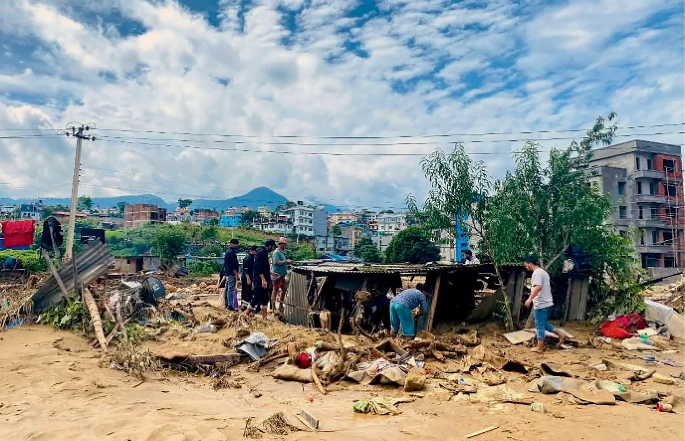

**📝 Abstract:**

> Nature Climate Change, Published online: 10 March 2026;
> doi:10.1038/s41558-025-02515-7Youth-led translation efforts provide
> solutions to make climate knowledge accessible worldwide.

**📝 摘要概括:**

> 青年主导的翻译工作为在全球范围内使气候知识更加普及提供了解决方案。

**🔍 解读点评:**

> 这篇评论文章聚焦一个常被忽视的气候公平问题：大量气候科学知识仅以英文发表，阻碍了非英语国家社区的适应行动。青年志愿者发起的翻译项目正在弥合这一鸿沟。研究呼吁学术界和政策制定者更重视知识的多语言传播。

🔗
[<u>https://doi.org/10.1038/s41558-025-02515-7</u>](https://doi.org/10.1038/s41558-025-02515-7)

────────────────────

## 3. Antarctic minerals in a warming world

*（变暖世界中的南极矿产）*

**📰 Nature Climate Change** \| 2026-03-09 *【Latest】*

Press, A. J. (2026). Antarctic minerals in a warming world. Nature
Climate Change.

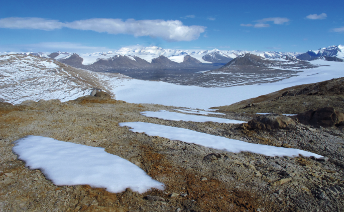

**📝 Abstract:**

> Nature Climate Change, Published online: 09 March 2026;
> doi:10.1038/s41558-026-02586-0Climate change will expose new ice-free
> areas of Antarctica. Now a study explores how climate change might
> spur the first ‘gold rush’ on the unexploited continent.

**📝 摘要概括:**

> 气候变化将暴露南极洲新的无冰区域。一项研究探讨了气候变化如何可能在这片尚未开发的大陆引发首次淘金热。

**🔍 解读点评:**

> 这是一篇极具前瞻性的分析文章。随着南极冰盖消融加速，原本深埋冰下的矿产资源可能变得可开采。研究警示：南极条约中的矿产禁令可能面临重新谈判的压力。在气候变化与地缘政治的交汇点上，南极的未来走向值得全球关注。

🔗
[<u>https://doi.org/10.1038/s41558-026-02586-0</u>](https://doi.org/10.1038/s41558-026-02586-0)

────────────────────

## 4. Severe winter storms bring severe population changes

*（严重冬季风暴带来严重的种群变化）*

**📰 Nature Ecology & Evolution** \| 2026-03-06 *【Latest】*

Rolland, V. (2026). Severe winter storms bring severe population
changes. Nature Ecology &amp; Evolution.

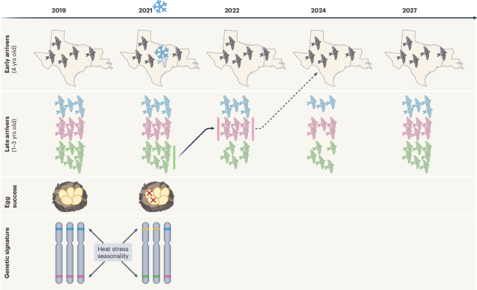

**📝 Abstract:**

> Nature Ecology & Evolution, Published online: 06 March 2026;
> doi:10.1038/s41559-026-02977-8A multi-trait analysis of a migratory
> songbird species shows that extreme winter storms have, beyond direct
> mortality, long-lasting effects on the phenology, genetics and
> demography of survivors.

**📝 摘要概括:**

> 对一种迁徙鸣禽的多性状分析表明，极端冬季风暴除了直接导致死亡外，还对幸存者的物候、遗传和种群统计产生长期影响。

**🔍 解读点评:**

> 研究追踪了一种候鸟在遭遇极端冬季风暴后的长期命运。令人惊讶的是，风暴的影响远不止即时死亡——幸存者的迁徙时间、繁殖成功率甚至遗传多样性都发生了改变。这种选择性筛选效应可能持续数年。

🔗
[<u>https://doi.org/10.1038/s41559-026-02977-8</u>](https://doi.org/10.1038/s41559-026-02977-8)

────────────────────

## 5. Drained Agricultural Peatlands as Persistent Carbon Sources: Implications for Carbon and Water Use Intensity in Food Production

*（排水农业泥炭地作为持续碳源：对粮食生产碳和水利用强度的影响）*

**📰 Global Change Biology** \| Mon, 09 Ma *【Latest】*

D'Acunha, B., Evans, C. D., Bodo, A., ... Morrison, R. (2026). Drained
Agricultural Peatlands as Persistent Carbon Sources: Implications for
Carbon and Water Use Intensity in Food Production. Global Change
Biology, 32(3), e70796.

**📝 摘要概括:**

> 研究评估了排水农业泥炭地的碳排放特征及其对粮食生产可持续性的影响。

**🔍 解读点评:**

> 全球约有5000万公顷泥炭地被排水用于农业。这项研究量化了这些土地持续释放的二氧化碳，揭示了一个令人担忧的事实：即使多年耕作后，排水泥炭地仍然是净碳源。研究呼吁重新评估泥炭地农业的真实成本。

🔗
[<u>https://onlinelibrary.wiley.com/doi/10.1111/gcb.70796</u>](https://onlinelibrary.wiley.com/doi/10.1111/gcb.70796)

────────────────────

## 6. Congo’s largest humic lakes emit ancient peat carbon

*（刚果最大的腐殖湖排放古老的泥炭碳）*

**📰 Nature Geoscience** \| 2026-03-04 *【Latest】*

(2026). Congo’s largest humic lakes emit ancient peat carbon. Nature
Geoscience.

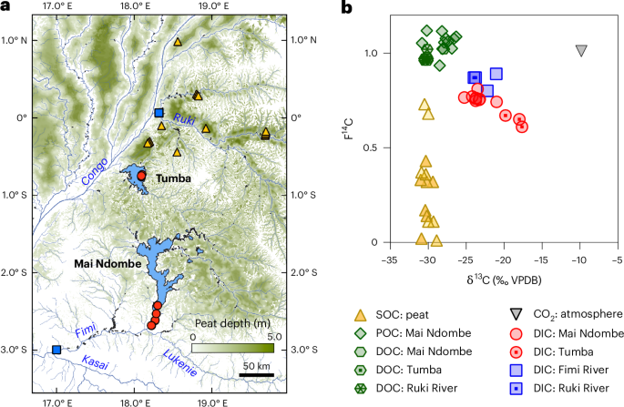

**📝 Abstract:**

> Nature Geoscience, Published online: 04 March 2026;
> doi:10.1038/s41561-026-01925-2We revealed that carbon dioxide
> emissions from the Congo Basin’s largest humic lakes partially
> originate from millennia-old peat. This discovery identifies a pathway
> whereby deep, long-sequestered carbon is respired and mobilized by
> subsurface flows, indicating these massive reservoirs of organic
> carbon are less inert than previously assumed.

**📝 摘要概括:**

> 研究揭示刚果盆地最大腐殖湖的二氧化碳排放部分来源于数千年前的泥炭。这一发现表明这些巨大的有机碳储库远不如之前假设的那样惰性。

**🔍 解读点评:**

> 刚果盆地拥有世界上最大的热带泥炭地，储存着约300亿吨碳。这项研究发现，这些本被认为稳定的碳储量实际上正在缓慢泄漏——数千年前封存的碳正通过地下水路径被释放到大气中。这一发现对全球碳循环模型有重要修正意义。

🔗
[<u>https://doi.org/10.1038/s41561-026-01925-2</u>](https://doi.org/10.1038/s41561-026-01925-2)

────────────────────

## 7. Nonlinear increase of compound drought-heatwave events since the early 2000s

*（自21世纪初复合干旱-热浪事件的非线性增加）*

**📰 Science Advances** \| 2026-03-06 *【Latest】*

Kim, Y., Yeh, S., Wang, G., & Ng, B. (2026). Nonlinear increase of
compound drought-heatwave events since the early 2000s. Science
Advances, 12(10), eaea3038.

**📝 摘要概括:**

> 研究发现自2000年代初以来，复合干旱-热浪事件的发生频率呈现加速增长的非线性趋势。

**🔍 解读点评:**

> 干旱和热浪同时发生的复合极端事件对生态系统和人类社会的危害远大于单一灾害。这项研究揭示了一个令人担忧的趋势：这类事件的增加速度在加快，呈现加速度模式。研究指出全球变暖是主因，但土地利用变化也起到了放大作用。

🔗
[<u>https://doi.org/10.1126/sciadv.aea3038</u>](https://doi.org/10.1126/sciadv.aea3038)

────────────────────

# 【环境科学与技术】

## 8. Nuclear fuel from saline waters

*（从盐水中提取核燃料）*

**📰 Nature Sustainability** \| 2026-03-05 *【Latest】*

Wiechert, A. I., Jang, G. G., & Tsouris, C. (2026). Nuclear fuel from
saline waters. Nature Sustainability.

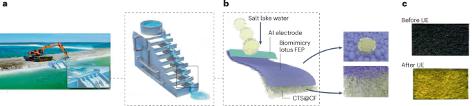

**📝 Abstract:**

> Nature Sustainability, Published online: 05 March 2026;
> doi:10.1038/s41893-026-01790-2Growing demand for nuclear fuel is
> accelerating the need for sustainable uranium resources that ensure
> long-term supply and mitigate environmental risks. A study now
> presents an intriguing self-powered methodology that utilizes the
> motion of falling water droplets to drive uranium recovery from salt
> lakes.

**📝 摘要概括:**

> 核燃料需求增长加速了对可持续铀资源的需求。一项研究提出了一种创新的自供电方法，利用下落水滴的运动从盐湖中提取铀。

**🔍 解读点评:**

> 这项技术创新将能源回收与核燃料生产巧妙结合。研究者设计了一种利用水滴下落动能驱动的铀提取系统，可从盐湖卤水中回收铀元素。这种方法不需要外部能源输入，有望为核能的可持续发展提供新的原料来源。

🔗
[<u>https://doi.org/10.1038/s41893-026-01790-2</u>](https://doi.org/10.1038/s41893-026-01790-2)

────────────────────

## 9. Compostable soft robots for plant monitoring

*（用于植物监测的可堆肥软体机器人）*

**📰 Nature Sustainability** \| 2026-03-05 *【Latest】*

Tan, Y. J. (2026). Compostable soft robots for plant monitoring. Nature
Sustainability.

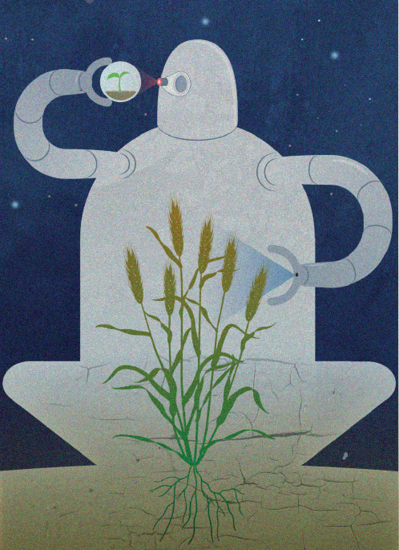

**📝 Abstract:**

> Nature Sustainability, Published online: 05 March 2026;
> doi:10.1038/s41893-025-01757-9Soft robots inspired by living organisms
> hold the promise of gentle, adaptable interactions with the natural
> world, but leave behind persistent waste. Now scientists show a fully
> compostable robotic system that addresses this limitation by offering
> durable performance and decomposing safely into the soil at the end of
> its life.

**📝 摘要概括:**

> 受生物体启发的软体机器人有望实现与自然界温和、适应性强的交互，但会留下持久的废弃物。科学家展示了一个完全可堆肥的机器人系统。

**🔍 解读点评:**

> 这是机器人技术与可持续发展理念的完美结合。研究团队开发的软体机器人可以在田间监测植物健康状况，完成任务后自然降解融入土壤，不留下任何塑料污染。这项技术有望在精准农业和生态监测领域得到广泛应用。

🔗
[<u>https://doi.org/10.1038/s41893-025-01757-9</u>](https://doi.org/10.1038/s41893-025-01757-9)

────────────────────

## 10. Reconstitution of woody biomass framework via dual-functional lignin engineering toward efficient and salt-resistant solar desalination

*（通过双功能木质素工程重构木质生物质框架实现高效抗盐太阳能海水淡化）*

**📰 Nature Communications** \| 2026-03-10 *【Latest】*

**📝 Abstract:**

> Nature Communications, Published online: 10 March 2026;
> doi:10.1038/s41467-026-70270-0Biomass-based systems for solar
> evaporation are a promising sustainable method to address global
> freshwater scarcity; however, current systems are inefficient. Here,
> the authors report a dual-function lignin-engineered reconstituted
> wood framework for a biomass-based solar evaporator.

**📝 摘要概括:**

> 基于生物质的太阳能蒸发系统是解决全球淡水短缺的可持续方法，但目前系统效率较低。研究者报告了一种双功能木质素工程重构木材框架。

**🔍 解读点评:**

> 研究巧妙利用木材的天然结构，通过改性木质素创造了高效的太阳能海水淡化材料。该系统不仅蒸发效率高，还能有效抵抗盐结晶堵塞。以废弃木材为原料的低成本特性使其特别适合资源匮乏的沿海社区。

🔗
[<u>https://doi.org/10.1038/s41467-026-70270-0</u>](https://doi.org/10.1038/s41467-026-70270-0)

────────────────────

## 11. \[ASAP\] DNAPL-Responsive Hydrogel Nanoreactor Encapsulating nZVI for Enhanced Degradation of Chlorinated Contaminants in Groundwater

*（DNAPL响应性水凝胶纳米反应器包裹nZVI用于增强地下水氯代污染物降解）*

**📰 Environmental Science & Technology** \| Tue, 10 Ma *【Latest】*

**📝 Abstract:**

> Environmental Science & TechnologyDOI: 10.1021/acs.est.5c16925

**📝 摘要概括:**

> 研究开发了一种智能水凝胶材料，可响应致密非水相液体污染物并释放纳米零价铁进行原位修复。

**🔍 解读点评:**

> 地下水氯代溶剂污染是全球性环境问题。这项研究的创新之处在于开发了一种智能修复材料——只有在接触到污染物时才会释放活性成分。这种靶向释放策略大大提高了修复效率并减少了化学品浪费。该技术有望革新地下水污染治理行业。

🔗
[<u>https://doi.org/10.1021/acs.est.5c16925</u>](https://doi.org/10.1021/acs.est.5c16925)

────────────────────

## 12. \[ASAP\] Can Benchmarking Increase the Accuracy of Predicting Biodegradation Rates across Aquatic Ecosystems?

*（基准测试能否提高跨水生生态系统生物降解速率预测的准确性）*

**📰 Environmental Science & Technology** \| Tue, 10 Ma *【Latest】*

**📝 Abstract:**

> Environmental Science & TechnologyDOI: 10.1021/acs.est.6c00470

**📝 摘要概括:**

> 研究探讨了使用基准化合物校准不同水生生态系统中有机污染物生物降解速率预测模型的可行性。

**🔍 解读点评:**

> 准确预测化学品在环境中的降解速率对于风险评估至关重要。这项研究测试了一种实用方法：使用参考化合物在不同水体中建立基准线来校正预测模型。研究结果对于监管机构评估新化学品的环境命运具有重要指导价值。

🔗
[<u>https://doi.org/10.1021/acs.est.6c00470</u>](https://doi.org/10.1021/acs.est.6c00470)

────────────────────

## 13. Molecular oxygen cascade reduction to •OH via coplanar dual-electrocatalytic zone achieving electrolyte-free water purification

*（分子氧通过共面双电催化区级联还原生成羟基自由基实现无电解质水净化）*

**📰 Nature Water** \| 2026-03-10 *【Latest】*

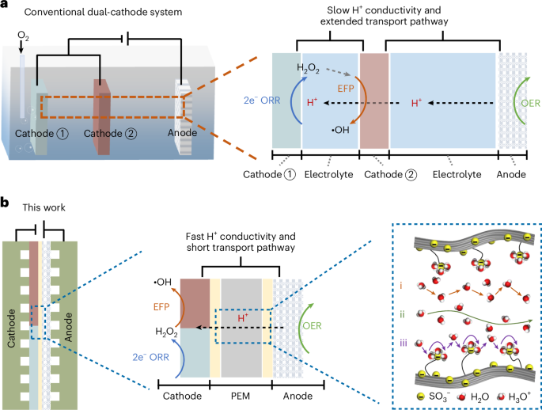

**📝 Abstract:**

> Nature Water, Published online: 10 March 2026;
> doi:10.1038/s44221-026-00606-zThis study presents an electrolyte-free
> electrochemical system that leverages dual electrocatalytic zones to
> effectively remove a wide range of recalcitrant pollutants across
> various water matrices, including low-conductivity organic wastewater.

**📝 摘要概括:**

> 该研究提出了一种无电解质电化学系统，利用双电催化区域有效去除各种水基质中的难降解污染物。

**🔍 解读点评:**

> 传统电化学水处理需要添加电解质以提高导电性，这增加了成本和二次污染风险。该研究开发的系统突破了这一限制，可直接处理低矿化度水体。通过巧妙的双区设计，系统可产生强氧化性羟基自由基降解顽固污染物。

🔗
[<u>https://doi.org/10.1038/s44221-026-00606-z</u>](https://doi.org/10.1038/s44221-026-00606-z)

────────────────────

## 14. Waste per- and polyfluoroalkyl substance-assisted flash fluorination for lithium recovery from brine

*（废弃全氟和多氟烷基物质辅助闪速氟化用于卤水锂回收）*

**📰 Nature Water** \| 2026-03-10 *【Latest】*

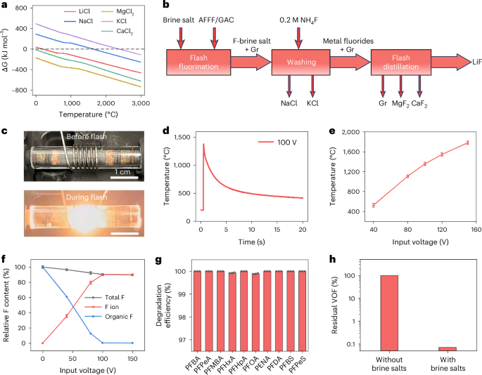

**📝 Abstract:**

> Nature Water, Published online: 10 March 2026;
> doi:10.1038/s44221-026-00593-1An electrothermal fluorination
> methodology has been developed to transform granular activated
> carbon-sorbed aqueous film-forming foam waste into graphene and a
> fluorinating reagent, subsequently enabling lithium recovery from
> brine sources.

**📝 摘要概括:**

> 研究开发了一种电热氟化方法，可将泡沫灭火剂废物转化为石墨烯和氟化试剂，用于从卤水中回收锂。

**🔍 解读点评:**

> 这项研究一石二鸟：既解决了PFAS永久化学品废物处理难题，又为锂资源回收开辟了新路径。PFAS被转化为有价值的石墨烯和氟化剂用于锂提取，实现了以废治废的循环经济理念。在电动汽车锂需求激增和PFAS污染治理双重压力下，这项技术展现出巨大的应用前景。

🔗
[<u>https://doi.org/10.1038/s44221-026-00593-1</u>](https://doi.org/10.1038/s44221-026-00593-1)

────────────────────

## 15. Rewiring energy flow in biohybrids for enhanced solar-driven biosynthesis

*（重塑生物杂交体中的能量流以增强太阳能驱动生物合成）*

**📰 Nature Sustainability** \| 2026-03-10 *【Latest】*

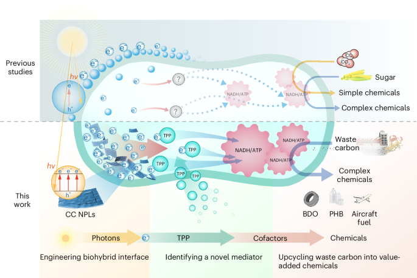

**📝 Abstract:**

> Nature Sustainability, Published online: 10 March 2026;
> doi:10.1038/s41893-026-01787-xSolar-driven biosynthesis using
> semiconductor biohybrids has the potential to achieve sustainable
> chemical production, but often it is hindered by inefficient solar
> energy conversion. Here the authors develop design strategies to
> tackle this technical challenge.

**📝 摘要概括:**

> 利用半导体生物杂交体进行太阳能驱动生物合成有望实现可持续化学品生产，但常因太阳能转化效率低而受阻。研究者开发了设计策略来解决这一技术挑战。

**🔍 解读点评:**

> 人工光合作用是绿色化工的圣杯。这项研究创新性地将无机半导体与活细胞结合，让微生物利用太阳能直接合成化学品。研究者通过优化半导体-细胞界面的能量传递，大幅提高了系统效率。这项技术有望使化工行业摆脱对化石燃料的依赖。

🔗
[<u>https://doi.org/10.1038/s41893-026-01787-x</u>](https://doi.org/10.1038/s41893-026-01787-x)

────────────────────

## 16. In situ degradation of biodegradable bio-based plastics in urban soil: Pilot study for PLA, PHB, PHBH, and Bio-PBS in central Tokyo, Japan

*（东京市中心城市土壤中生物基可降解塑料的原位降解试点研究）*

**📰 Science of the Total Environment** *【Latest】*

**📝 Abstract:**

> Publication date: 15 April 2026Source: Science of The Total
> Environment, Volume 1025Author(s): Ayano Kobayashi, Yoshiki Harada,
> Yoshiharu Mitoma

**📝 摘要概括:**

> 研究在东京市中心城市土壤中测试了四种生物基可降解塑料的实际降解表现。

**🔍 解读点评:**

> 可降解塑料在实际环境中真的能降解吗？这项研究在东京城市土壤中进行了实地测试，结果令人警醒：多数生物可降解塑料在城市土壤条件下降解极其缓慢。研究强调了实验室测试与实际环境表现之间的巨大差距。

🔗
[<u>https://www.sciencedirect.com/science/article/pii/S0048969726002937</u>](https://www.sciencedirect.com/science/article/pii/S0048969726002937)

────────────────────

## 17. Potential One Health risk of downwind exposure to airborne pathogens from thawing Siberian permafrost

*（西伯利亚永久冻土融化释放的空气传播病原体对下风向地区的潜在健康风险）*

**📰 Environmental Research Letters** \| 2026-03-10 *【Latest】*

Martinetti, D., Stucchi, D., Bevacqua, D., ... Casagrandi, R. (2026).
Potential one health risk of downwind exposure to airborne pathogens
from thawing Siberian permafrost. Environmental Research Letters.

**📝 Abstract:**

> Permafrost degradation in Arctic and Subarctic regions, accelerating
> due to rapid climate change, exposes vast extents of ice- and organic
> matter-rich soils directly to the atmosphere. This ancient permafrost
> is known to harbor metabolically active microbes, including
> potentially harmful pathogens that have survived for thousands of
> years under extreme environmental conditions. The release and
> subsequent long-range dispersal of these organisms via atmospheric
> transport presents a significant, yet often neglected, pathway for
> novel disease emergence. Here, we develop a quantitative risk
> framework to geographically identify downwind areas in the Palearctic
> region potentially reached by air-transported pathogens emerging from
> Siberian retrogressive thaw slumps. We simulate air-mass trajectori

**📝 摘要概括:**

> 北极和亚北极地区的永久冻土退化正因快速气候变化而加速，将富含冰和有机物的土壤直接暴露于大气。这些古老的永久冻土已知含有代谢活跃的微生物，包括在极端环境条件下存活数千年的潜在有害病原体。

**🔍 解读点评:**

> 这项研究首次量化评估了西伯利亚融化永久冻土释放的古老病原体可能到达的地理范围。模拟显示，大气可以将这些微生物传播到东欧、甚至西欧人口密集区。虽然实际感染风险仍需进一步评估，但研究敲响了警钟：气候变化可能带来意想不到的公共卫生挑战。

🔗
[<u>https://iopscience.iop.org/article/10.1088/1748-9326/ae4819</u>](https://iopscience.iop.org/article/10.1088/1748-9326/ae4819)

────────────────────

## 18. Alcohol group migration by proximity-enhanced H atom abstraction

*（通过临近增强的H原子抽取实现醇基团迁移）*

**📰 Nature** \| 2026-03-10 *【Latest】*

**📝 Abstract:**

> Nature, Published online: 10 March 2026;
> doi:10.1038/s41586-026-10347-4Alcohol group migration by
> proximity-enhanced H atom abstraction

**📝 摘要概括:**

> 研究报告了一种新型化学反应机制，通过分子内临近效应增强的氢原子抽取实现醇羟基的迁移。

**🔍 解读点评:**

> Nature这篇论文报道了一种全新的有机化学反应类型。研究者发现，在特定条件下醇分子中的羟基可以在碳链上迁移——这打破了传统有机化学教科书中的认知。这一发现可能开启合成化学的新篇章，为制药和材料科学提供新的分子构建策略。

🔗
[<u>https://doi.org/10.1038/s41586-026-10347-4</u>](https://doi.org/10.1038/s41586-026-10347-4)

────────────────────

## 19. In situ synchrotron X-ray scattering reveals organic-mediated scaling mechanisms on desalination membranes

*（原位同步辐射X射线散射揭示海水淡化膜上有机物介导的结垢机制）*

**📰 Nature Communications** \| 2026-03-10 *【Latest】*

**📝 Abstract:**

> Nature Communications, Published online: 10 March 2026;
> doi:10.1038/s41467-026-70508-xScaling is a major challenge in
> engineered systems. This study employs in situ synchrotron X-ray
> scattering to reveal how organic matter alters nucleation and
> crystallization pathways, thereby regulating gypsum scaling on
> desalination membranes.

**📝 摘要概括:**

> 结垢是工程系统中的主要挑战。该研究采用原位同步辐射X射线散射揭示了有机物如何改变成核和结晶路径，从而调节海水淡化膜上的石膏结垢。

**🔍 解读点评:**

> 膜结垢是海水淡化的阿喀琉斯之踵，严重影响效率和使用寿命。这项研究利用先进的X射线成像技术，首次实时观看了结垢晶体在膜表面的生长过程。关键发现是有机物显著改变了结晶路径——这解释了为什么不同水源的结垢行为差异巨大。

🔗
[<u>https://doi.org/10.1038/s41467-026-70508-x</u>](https://doi.org/10.1038/s41467-026-70508-x)

────────────────────

## 20. \[ASAP\] Liquid Biofuels for Transportation: Lessons of the Last Two Decades for the Next Two

*（交通运输用液体生物燃料：过去二十年的教训与未来二十年的展望）*

**📰 Environmental Science & Technology** \| Tue, 10 Ma *【Latest】*

**📝 Abstract:**

> Environmental Science & TechnologyDOI: 10.1021/acs.est.5c16314

**📝 摘要概括:**

> 文章回顾了液体生物燃料过去二十年的发展历程，总结经验教训并展望未来二十年的发展方向。

**🔍 解读点评:**

> 这是一篇重要的综述文章，系统评估了生物燃料行业的得失。过去二十年，玉米乙醇和生物柴油经历了从热捧到质疑的过程——粮食安全、土地利用变化和实际碳减排效果都受到争议。文章指出，未来生物燃料应聚焦于真正的废弃生物质和可持续航空燃料。

🔗
[<u>https://doi.org/10.1021/acs.est.5c16314</u>](https://doi.org/10.1021/acs.est.5c16314)

────────────────────

# 【森林与陆地生态】

## 21. Climate change will increase forest disturbances in Europe throughout the 21st century

*（气候变化将在整个21世纪增加欧洲森林干扰）*

**📰 Science** \| 2026-03-05 *【Latest】*

Grünig, M., Rammer, W., Senf, C., ... Seidl, R. (2026). Climate change
will increase forest disturbances in Europe throughout the 21st century.
Science, 391(6789), eadx6329.

**📝 摘要概括:**

> 研究预测气候变化将导致欧洲森林在21世纪面临更多的干扰事件，包括火灾、病虫害和极端天气影响。

**🔍 解读点评:**

> Science这篇论文为欧洲林业敲响了警钟：模型预测显示，随着气候变暖，欧洲森林将面临前所未有的干扰压力。火灾、风暴和昆虫暴发的频率和强度都将增加，可能导致森林碳汇功能减弱甚至逆转为碳源。研究强调需要提前规划适应性森林管理策略。

🔗
[<u>https://doi.org/10.1126/science.adx6329</u>](https://doi.org/10.1126/science.adx6329)

────────────────────

## 22. Influences of Structural and Species Diversity on Forest Resistance to Drought

*（结构和物种多样性对森林抗旱性的影响）*

**📰 Ecology Letters** \| Thu, 05 Ma *【Latest】*

Crockett, E. T. H., Guo, Q., Atkins, J. W., ... Xiao, J. (2026).
Influences of Structural and Species Diversity on Forest Resistance to
Drought. Ecology Letters, 29(3), e70351.

**📝 摘要概括:**

> 研究探讨了森林结构多样性和物种多样性如何共同影响森林抵抗干旱的能力。

**🔍 解读点评:**

> 这项Ecology
> Letters研究为多样性-稳定性假说提供了新证据。分析发现，森林的抗旱能力不仅取决于树种的多样性，还与森林结构的复杂程度密切相关。多层次的林冠结构和丰富的树种组合能创造微气候缓冲带，提高整体生态系统的韧性。

🔗
[<u>https://onlinelibrary.wiley.com/doi/10.1111/ele.70351</u>](https://onlinelibrary.wiley.com/doi/10.1111/ele.70351)

────────────────────

## 23. Effects of Ungulate Herbivores on Temperate Forest Understory Vegetation—Implications From a Large‐Scale Wildlife Exclosure Experiment in Central Europe

*（有蹄类食草动物对温带森林林下植被的影响——来自中欧大规模野生动物围栏实验的启示）*

**📰 Journal of Vegetation Science** \| Sun, 08 Ma *【Latest】*

Seliger, A., Zäh, J., Heinrichs, S., ... Vor, T. (2026). Effects of
Ungulate Herbivores on Temperate Forest Understory
Vegetation—Implications From a Large‐Scale Wildlife Exclosure Experiment
in Central Europe. Journal of Vegetation Science, 37(2), e70128.

**📝 Abstract:**

> Journal of Vegetation Science, Volume 37, Issue 2, March/April 2026.

**📝 摘要概括:**

> 研究通过大规模围栏实验评估了有蹄类动物取食对中欧温带森林林下植被的影响。

**🔍 解读点评:**

> 鹿类等大型食草动物数量在许多地区激增，对森林生态系统产生深远影响。这项大型围栏实验清晰展示了：在排除有蹄类动物后，林下层植被发生了显著变化——更多幼树得以存活，草本植物多样性增加。研究结果对于平衡野生动物管理与森林更新具有实际指导意义。

🔗
[<u>https://onlinelibrary.wiley.com/doi/10.1111/jvs.70128</u>](https://onlinelibrary.wiley.com/doi/10.1111/jvs.70128)

────────────────────

## 24. Forest Heterogeneity by Chain Saw: How Between‐Patch Variation in Old Growth Attributes Changes the Metacommunities of Beetles

*（森林异质性与链锯：老龄林斑块间属性变化如何改变甲虫的元群落）*

**📰 Ecology Letters** \| Thu, 05 Ma *【Latest】*

Mitesser, O., Cadotte, M. W., Mori, A. S., ... Müller, J. (2026). Forest
Heterogeneity by Chain Saw: How Between‐Patch Variation in Old Growth
Attributes Changes the Metacommunities of Beetles. Ecology Letters,
29(3), e70355.

**📝 摘要概括:**

> 研究探讨了森林管理创造的老龄林特征斑块间异质性如何影响甲虫群落的空间格局。

**🔍 解读点评:**

> 这是一项将生态学理论与林业实践相结合的创新研究。研究者通过人为创造不同程度的老龄林特征（如倒木、枯立木），发现这种人工异质性显著改变了甲虫群落的组成和多样性格局。研究为在人工林中恢复生物多样性提供了实用策略。

🔗
[<u>https://onlinelibrary.wiley.com/doi/10.1111/ele.70355</u>](https://onlinelibrary.wiley.com/doi/10.1111/ele.70355)

────────────────────

# 【海洋与水生态】

## 25. Global Marine Fishery Stock Productivity Under Climate Change

*（气候变化下全球海洋渔业资源生产力研究）*

**📰 Global Change Biology** \| Mon, 09 Ma *【Latest】*

Ma, S., Huse, G., Ono, K., ... Kjesbu, O. S. (2026). Global Marine
Fishery Stock Productivity Under Climate Change. Global Change Biology,
32(3), e70784.

**📝 摘要概括:**

> 该研究评估了气候变化对全球海洋渔业资源生产力的影响，分析了不同气候情景下渔业产量的变化趋势。

**🔍 解读点评:**

> 这是一项关于气候变化如何影响全球海洋渔业的重要研究。随着海水温度上升和酸化加剧，许多商业鱼类种群的分布和丰度正在发生变化。研究的发现将帮助渔业管理者制定适应性策略，确保渔业资源的可持续利用，同时维护依赖渔业的沿海社区的生计。

🔗
[<u>https://onlinelibrary.wiley.com/doi/10.1111/gcb.70784</u>](https://onlinelibrary.wiley.com/doi/10.1111/gcb.70784)

────────────────────

## 26. Range-edge effects of marine heatwaves

*（海洋热浪的分布边缘效应）*

**📰 Nature Ecology & Evolution** \| 2026-03-06 *【Latest】*

Marzloff, M. P. (2026). Range-edge effects of marine heatwaves. Nature
Ecology &amp; Evolution.

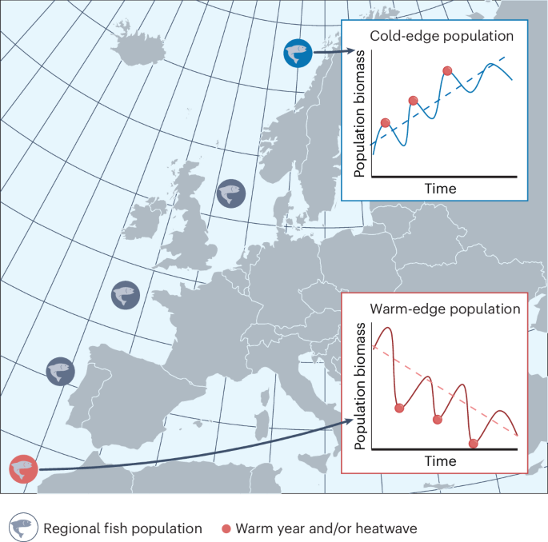

**📝 Abstract:**

> Nature Ecology & Evolution, Published online: 06 March 2026;
> doi:10.1038/s41559-026-03023-3An analysis of hundreds of fish biomass
> surveys shows that warmer years combined with marine heatwaves can
> enhance regional population abundances in the cold edges of species’
> biogeographical distributions, but contribute to population declines
> at warmer latitudes.

**📝 摘要概括:**

> 对数百次鱼类生物量调查的分析表明，较暖年份与海洋热浪的结合可以在物种地理分布冷边缘提高区域种群丰度，但会导致温暖纬度的种群下降。

**🔍 解读点评:**

> 研究揭示了海洋热浪对鱼类的双刃剑效应：在物种分布的北部冷水边缘，升温反而促进了种群增长；但在南部温暖边缘，热浪加剧了种群衰退。这意味着气候变化正在重塑海洋生物的地理分布格局。

🔗
[<u>https://doi.org/10.1038/s41559-026-03023-3</u>](https://doi.org/10.1038/s41559-026-03023-3)

────────────────────

## 27. Diversity and ecology of the prokaryotic microbiome associated with marine sponges across Antarctica

*（南极洲海绵相关原核微生物组的多样性和生态学）*

**📰 Science of the Total Environment** *【Latest】*

**📝 Abstract:**

> Publication date: 15 April 2026Source: Science of The Total
> Environment, Volume 1025Author(s): Angelina Lo Giudice, Maria Papale,
> Marco Bertolino, Anna Reboa, Carmen Rizzo

**📝 摘要概括:**

> 研究调查了南极洲多个地点海绵相关原核微生物群落的多样性和生态学特征。

**🔍 解读点评:**

> 南极海绵作为海底生态系统的关键物种，其共生微生物群落蕴含着适应极端环境的独特机制。研究揭示了这些微生物的多样性格局及其与宿主海绵的共生关系。在南极生态系统面临气候变化压力的背景下，理解这些微生物的功能角色具有重要价值。

🔗
[<u>https://www.sciencedirect.com/science/article/pii/S0048969726003165</u>](https://www.sciencedirect.com/science/article/pii/S0048969726003165)

────────────────────

## 28. Emma Johnston (1973–2025)

*（Emma Johnston (1973-2025)）*

**📰 Nature Ecology & Evolution** \| 2026-03-10 *【Latest】*

**📝 Abstract:**

> Nature Ecology & Evolution, Published online: 10 March 2026;
> doi:10.1038/s41559-026-03018-0Innovative marine ecologist, passionate
> science communicator and visionary leader in higher education.

**📝 摘要概括:**

> 创新的海洋生态学家、热情的科学传播者和高等教育领域的远见领导者。

**🔍 解读点评:**

> 这篇讣告纪念了澳大利亚杰出海洋生态学家Emma
> Johnston教授。她在海洋生物入侵和城市生态学领域做出了开创性贡献，同时是推动科学公众参与的先驱。她的离世是全球海洋科学界的重大损失。

🔗
[<u>https://doi.org/10.1038/s41559-026-03018-0</u>](https://doi.org/10.1038/s41559-026-03018-0)

────────────────────

## 29. A novel kleptoplastidic symbiosis revealed in the marine centrohelid Meringosphaera with evidence of genetic integration

*（海洋中心鞭毛虫中发现新型盗食质体共生关系及遗传整合证据）*

**📰 Current Biology** *【Latest】*

**📝 Abstract:**

> Publication date: 9 March 2026Source: Current Biology, Volume 36,
> Issue 5Author(s): Megan E.S. Sørensen, Vasily V. Zlatogursky, Ioana
> Onuţ-Brännström, Anne Walraven, Rachel A. Foster, Fabien Burki

**📝 摘要概括:**

> 研究在一种海洋中心鞭毛虫中发现了新型盗食质体共生现象，并找到了共生体遗传物质整合到宿主基因组的证据。

**🔍 解读点评:**

> 盗食质体是一种奇特的现象：某些生物偷其他生物的叶绿体来进行光合作用。这项研究在一种罕见的海洋原生生物中发现了这种共生关系的新形式，更重要的是发现了共生体基因向宿主转移的证据。这一发现为理解叶绿体起源和真核生物进化提供了研究窗口。

🔗
[<u>https://www.sciencedirect.com/science/article/pii/S0960982226001569</u>](https://www.sciencedirect.com/science/article/pii/S0960982226001569)

────────────────────

## 30. Anaemic Streams: Iron and Essential Trace Metals Frequently Limit Primary Producer Biomass

*（贫血的溪流：铁和必需微量金属经常限制初级生产者生物量）*

**📰 Ecology Letters** \| Sun, 08 Ma *【Latest】*

Costello, D. M., Akinnifesi, O. J., Schipper, R. C., ... Fletcher, D. E.
(2026). Anaemic Streams: Iron and Essential Trace Metals Frequently
Limit Primary Producer Biomass. Ecology Letters, 29(3), e70357.

**📝 摘要概括:**

> 研究发现铁和其他必需微量金属是限制溪流初级生产者生物量的常见因素。

**🔍 解读点评:**

> 传统上认为氮和磷是淡水生态系统的主要限制因子，但这项研究揭示了一个被忽视的因素：微量金属。全球多个溪流的实验表明，添加铁等微量元素后藻类生物量显著增加。这一发现对于理解溪流生态系统的运作机制具有重要启示。

🔗
[<u>https://onlinelibrary.wiley.com/doi/10.1111/ele.70357</u>](https://onlinelibrary.wiley.com/doi/10.1111/ele.70357)

────────────────────

## 31. Water scientists must become agenda-setters

*（水科学家必须成为议程制定者）*

**📰 Nature Water** \| 2026-03-09 *【Latest】*

Madani, K., & Sjöstrand, K. (2026). Water scientists must become
agenda-setters. Nature Water.

**📝 Abstract:**

> Nature Water, Published online: 09 March 2026;
> doi:10.1038/s44221-026-00613-0The global water agenda is outdated and
> narrow and is framed mainly as a downstream impact sector. Scientists
> must step up to help the world recognize water as an opportunity
> sector and to design a bolder water agenda.

**📝 摘要概括:**

> 全球水议程已经过时且狭隘，主要被定位为下游影响部门。科学家必须挺身而出，帮助世界认识到水是机遇部门，并设计更大胆的水议程。

**🔍 解读点评:**

> 这是Nature
> Water的社论文章，呼吁水科学家从被动响应转向主动引领。长期以来，水问题被视为气候变化的下游影响，但实际上水是连接气候、能源、粮食和生态系统的核心枢纽。文章认为科学家应更积极参与政策制定，将水资源管理从问题应对转变为发展机遇。

🔗
[<u>https://doi.org/10.1038/s44221-026-00613-0</u>](https://doi.org/10.1038/s44221-026-00613-0)

────────────────────

## 32. Meta analysis of Manning's coefficient for saltmarsh and mangroves to support broad scale assessment

*（盐沼和红树林曼宁系数的元分析以支持大尺度评估）*

**📰 Estuarine Coastal and Shelf Science** *【Latest】*

**📝 Abstract:**

> Publication date: 1 July 2026Source: Estuarine, Coastal and Shelf
> Science, Volume 334Author(s): Syed Shamsil Arefin, Robert J. Nicholls,
> Stefanie Nolte, Jack Heslop

**📝 摘要概括:**

> 研究对盐沼和红树林的曼宁糙率系数进行了元分析，为海岸保护和洪水模拟的大尺度评估提供参数支持。

**🔍 解读点评:**

> 盐沼和红树林是重要的天然海岸防护屏障，但定量评估其消浪能力需要准确的水力学参数。曼宁系数描述了水流在植被中受到的阻力。这项元分析汇总了全球研究数据，为不同类型盐沼和红树林提供了统一的参数建议。这些数据对于海岸带洪水风险评估至关重要。

🔗
[<u>https://www.sciencedirect.com/science/article/pii/S0272771426000867</u>](https://www.sciencedirect.com/science/article/pii/S0272771426000867)

────────────────────

## 33. Monitoring coastal shoreline change using PlanetScope imagery

*（使用PlanetScope影像监测海岸线变化）*

**📰 Estuarine Coastal and Shelf Science** *【Latest】*

**📝 Abstract:**

> Publication date: 1 July 2026Source: Estuarine, Coastal and Shelf
> Science, Volume 334Author(s): Boyuan Tan, Halle Cooper, Monique
> LaFrance Bartley, Catherine Johnson, Sergio Fagherazzi, Cédric G.
> Fichot

**📝 摘要概括:**

> 研究开发了使用PlanetScope高分辨率卫星影像监测海岸线变化的方法。

**🔍 解读点评:**

> 准确监测海岸线变化对于应对海平面上升和海岸侵蚀至关重要。PlanetScope星座提供了前所未有的高频次、高分辨率观测能力。这项研究开发并验证了从这些影像自动提取海岸线的算法，可以捕捉风暴后的快速变化。研究成果将大大提升全球海岸带的动态监测能力。

🔗
[<u>https://www.sciencedirect.com/science/article/pii/S0272771426000788</u>](https://www.sciencedirect.com/science/article/pii/S0272771426000788)

────────────────────

# 【植物与农业】

## 34. Amazon rainforests are rejuvenating their canopies by producing more photosynthetically efficient young leaves under climate change

*（亚马逊雨林在气候变化下通过产生更多光合效率高的嫩叶来更新其冠层）*

**📰 Nature Plants** \| 2026-03-09 *【Latest】*

Yang, X., Tian, J., Ciais, P., ... Chen, X. (2026). Amazon rainforests
are rejuvenating their canopies by producing more photosynthetically
efficient young leaves under climate change. Nature Plants.

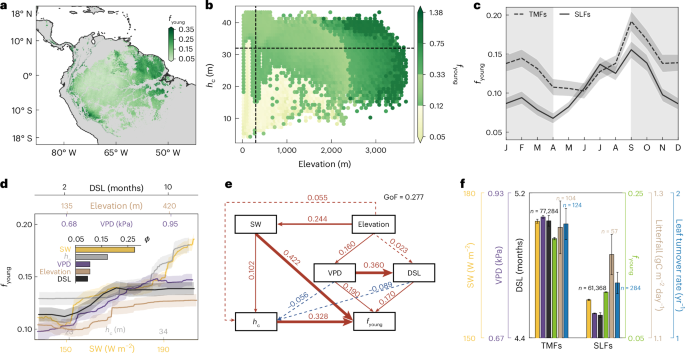

**📝 Abstract:**

> Nature Plants, Published online: 09 March 2026;
> doi:10.1038/s41477-026-02240-9The authors mapped the continental-scale
> fraction of age-dependent leaf area index and revealed a widespread
> increase in the fraction of photosynthetically efficient young leaves
> across the majority of Amazon rainforests over the past decades.

**📝 摘要概括:**

> 研究者绘制了大陆尺度上与叶龄相关的叶面积指数分布，揭示了过去几十年间亚马逊雨林大部分地区光合效率高的嫩叶比例普遍增加的趋势。

**🔍 解读点评:**

> 这项突破性研究发现亚马逊雨林正在通过一种意想不到的方式应对气候变化——加速叶片更新。年轻叶片具有更高的光合作用效率，这意味着森林可能比我们预期的更具韧性。然而，这种年轻化策略是否可持续，以及其对整体碳循环的影响，仍需要长期观察。

🔗
[<u>https://doi.org/10.1038/s41477-026-02240-9</u>](https://doi.org/10.1038/s41477-026-02240-9)

────────────────────

## 35. Plant Community Responses to Long‐Term Nutrient Additions Interact With Elevation and Vegetation Type in a Subarctic Tundra

*（亚北极苔原中植物群落对长期养分添加的响应与海拔和植被类型的交互作用）*

**📰 Journal of Vegetation Science** \| Wed, 04 Ma *【Latest】*

ten Kate, G. M., Wardle, D. A., Stangl, Z. R., & Sundqvist, M. K.
(2026). Plant Community Responses to Long‐Term Nutrient Additions
Interact With Elevation and Vegetation Type in a Subarctic Tundra.
Journal of Vegetation Science, 37(2), e70125.

**📝 Abstract:**

> Journal of Vegetation Science, Volume 37, Issue 2, March/April 2026.

**📝 摘要概括:**

> 研究探讨了亚北极苔原中养分添加对植物群落的长期影响如何受到海拔和植被类型的调节。

**🔍 解读点评:**

> 这项长期实验研究揭示了北极苔原对营养物质输入的复杂响应。随着气候变暖加速永久冻土解冻和养分释放，理解这些生态系统的响应模式至关重要。研究发现不同海拔和植被类型的苔原对施肥的响应差异显著。

🔗
[<u>https://onlinelibrary.wiley.com/doi/10.1111/jvs.70125</u>](https://onlinelibrary.wiley.com/doi/10.1111/jvs.70125)

────────────────────

## 36. Implementation of practices shapes the effectiveness of agricultural diversification for arthropod related ecosystem services: a meta-analysis

*（实施方式塑造农业多样化对节肢动物生态系统服务的有效性：一项元分析）*

**📰 Agronomy for Sustainable Development** \| 2026-02-26 *【Latest】*

Seimandi-Corda, G., MacLaren, C., Tougeron, K., ... Cook, S. M. (2026).
Implementation of practices shapes the effectiveness of agricultural
diversification for arthropod related ecosystem services: a
meta-analysis. Agronomy for Sustainable Development, 46(2), 19.

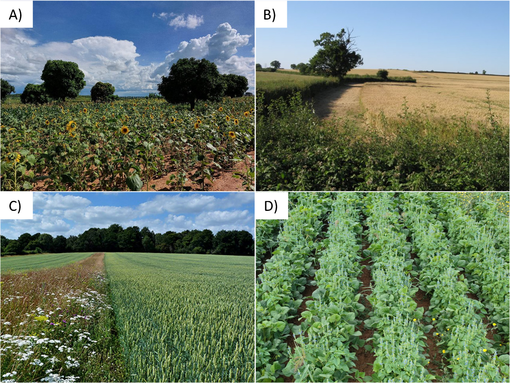

**📝 Abstract:**

> Agricultural intensification has increased food production but has
> also caused significant environmental degradation and biodiversity
> loss. Diversification practices can mitigate these impacts while
> sustaining yields. While previous meta-analyses have examined their
> effects on arthropod populations and associated ecosystem services,
> focusing on individual practices or treating them as a whole, this is
> the first study to compare a wide range of diversification strategies
> across specific arthropod groups and assess how management factors,
> such as plant diversity, spatial configuration, and sowing time,
> modulate their outcome. Clarifying these mechanisms is crucial for
> optimizing diversification practices and enhancing their adoption by
> farmers. We conducted the most up-to-date and comprehens

**📝 摘要概括:**

> 农业集约化虽然提高了粮食产量，但也造成了严重的环境退化和生物多样性丧失。多样化措施可以在维持产量的同时减轻这些影响。

**🔍 解读点评:**

> 这项元分析综合了大量研究证据，为农业多样化实践提供了科学指导。研究发现，多样化措施的效果高度依赖于具体实施方式——包括植物多样性水平、空间配置和播种时间等。间作、花带和减少耕作等措施对天敌昆虫和传粉者有显著促进作用。

🔗
[<u>https://link.springer.com/article/10.1007/s13593-025-01082-7</u>](https://link.springer.com/article/10.1007/s13593-025-01082-7)

────────────────────

## 37. Grain zinc, iron and protein concentrations of contemporary wheat cultivars fall short of targets for human health

*（现代小麦品种的籽粒锌、铁和蛋白质浓度低于人类健康目标）*

**📰 Nature Food** \| 2026-03-09 *【Latest】*

Devkota, M., Sileshi, G. W., Senthilkumar, K., ... Kihara, J. (2026).
Grain zinc, iron and protein concentrations of contemporary wheat
cultivars fall short of targets for human health. Nature Food.

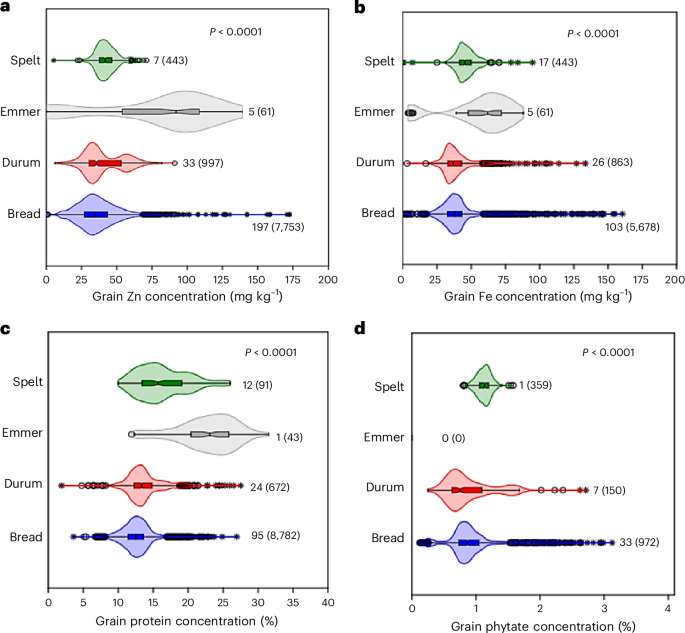

**📝 Abstract:**

> Nature Food, Published online: 09 March 2026;
> doi:10.1038/s43016-026-01314-3A synthesis of 243 field studies shows
> that grain zinc, iron and protein concentrations in modern wheat
> cultivars have declined since the 1960s, with most varieties falling
> short of recommended nutritional targets. While agronomic and genetic
> biofortification can improve these traits, the likelihood of reaching
> target nutrient levels remains low, highlighting the need for
> integrated strategies.

**📝 摘要概括:**

> 对243项田间研究的综合分析表明，自1960年代以来现代小麦品种的籽粒锌、铁和蛋白质浓度已经下降，大多数品种达不到推荐的营养目标。

**🔍 解读点评:**

> 这项研究揭示了绿色革命的隐性代价：数十年来为追求高产而培育的小麦品种，其营养密度却在悄然下降。研究发现即使通过生物强化技术也难以完全弥补这一差距。这对全球营养安全敲响警钟——我们需要重新定义高产的内涵。

🔗
[<u>https://doi.org/10.1038/s43016-026-01314-3</u>](https://doi.org/10.1038/s43016-026-01314-3)

────────────────────

## 38. An NLR–transposase fusion gene from rye provides broadly effective resistance to stripe rust in wheat

*（来自黑麦的NLR-转座酶融合基因为小麦提供广谱条锈病抗性）*

**📰 Nature Plants** \| 2026-03-06 *【Latest】*

Wang, C., Fu, S., Yi, C., ... Han, F. (2026). An NLR–transposase fusion
gene from rye provides broadly effective resistance to stripe rust in
wheat. Nature Plants.

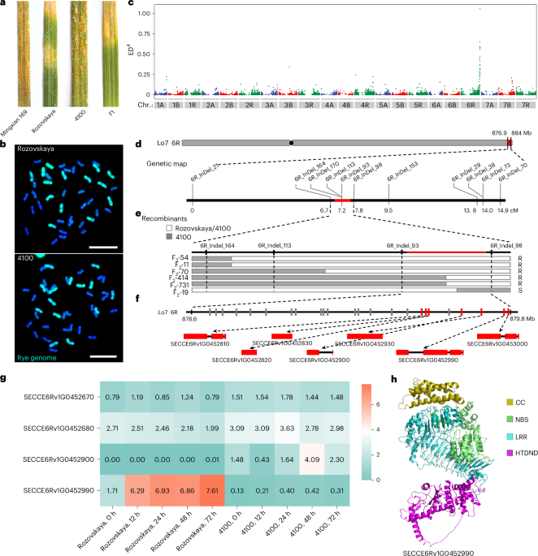

**📝 Abstract:**

> Nature Plants, Published online: 06 March 2026;
> doi:10.1038/s41477-026-02248-1Researchers have cloned the
> broad-spectrum stripe rust resistance gene Yr83 from rye via
> triticale. This gene encodes a unique NLR–transposase fusion protein,
> offering a pivotal genetic resource for wheat breeding.

**📝 摘要概括:**

> 研究者通过小黑麦克隆了来自黑麦的广谱条锈病抗性基因Yr83。该基因编码一种独特的NLR-转座酶融合蛋白，为小麦育种提供了关键遗传资源。

**🔍 解读点评:**

> 条锈病每年给全球小麦生产造成数十亿美元损失。这项研究从小麦的野生近缘种黑麦中克隆出了一个超级抗病基因Yr83。有趣的是，这个基因是两种不同基因类型的融合产物，代表了自然进化创造的独特防御机制。该发现对保障全球粮食安全具有重要意义。

🔗
[<u>https://doi.org/10.1038/s41477-026-02248-1</u>](https://doi.org/10.1038/s41477-026-02248-1)

────────────────────

## 39. A framework for estimating manure nitrogen balance and recycling potential for current and future conditions in the USA

*（美国当前和未来条件下畜禽粪便氮平衡和循环潜力评估框架）*

**📰 Nature Food** \| 2026-03-09 *【Latest】*

Wang, Y., Zhang, X., Spiegal, S., & Davidson, E. A. (2026). A framework
for estimating manure nitrogen balance and recycling potential for
current and future conditions in the USA. Nature Food.

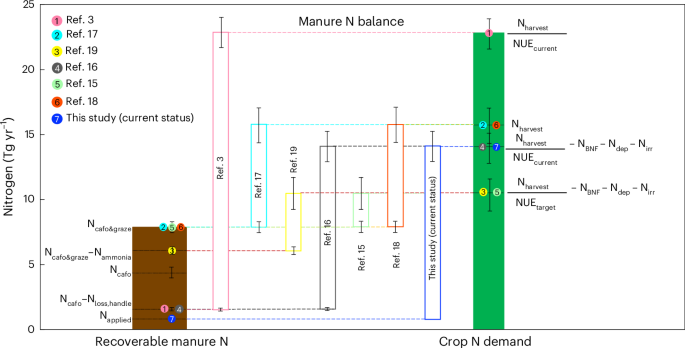

**📝 Abstract:**

> Nature Food, Published online: 09 March 2026;
> doi:10.1038/s43016-026-01312-5An assessment framework is developed and
> applied to the USA, quantifying low rates of current manure recycling
> and showing that improved manure management and technological
> development could supply crops with nitrogen equivalent to as much as
> a quarter of current synthetic N fertilizer use.

**📝 摘要概括:**

> 研究开发并应用于美国的评估框架量化了当前较低的粪便循环利用率，并表明改进粪便管理和技术发展可以提供相当于当前合成氮肥使用量四分之一的作物氮素供应。

**🔍 解读点评:**

> 美国畜牧业每年产生超过10亿吨粪便，其中的氮素大多被浪费甚至成为污染源。这项研究描绘了一个更可持续的图景：通过改进收集、处理和施用技术，粪便氮可以替代大约25%的合成氮肥。这不仅能减少肥料生产的碳排放，还能减轻畜牧业的环境压力。

🔗
[<u>https://doi.org/10.1038/s43016-026-01312-5</u>](https://doi.org/10.1038/s43016-026-01312-5)

────────────────────

## 40. Nanodomain-localized formin gates symbiotic microbial entry in legume and solanaceous plants

*（纳米域定位的成形蛋白门控豆科和茄科植物的共生微生物入侵）*

**📰 Science** \| 2026-03-05 *【Latest】*

Qiao, L., Sun, H., Tang, J., ... Liang, P. (2026). Nanodomain-localized
formin gates symbiotic microbial entry in legume and solanaceous plants.
Science, 391(6789), 1036-1045.

**📝 Abstract:**

> Science, Volume 391, Issue 6789, Page 1036-1045, March 2026.

**📝 摘要概括:**

> 研究揭示了一种定位于细胞膜纳米域的成形蛋白，它在豆科和茄科植物中控制共生微生物的进入。

**🔍 解读点评:**

> 豆科植物与根瘤菌的共生是自然界最重要的氮循环过程之一。这项Science研究揭示了植物如何开门接纳共生细菌的分子机制：一种特殊的成形蛋白在细胞膜特定位置聚集，协助细菌穿越植物细胞壁进入根部。这一发现可能为工程化非豆科作物建立固氮共生提供关键线索。

🔗
[<u>https://doi.org/10.1126/science.adx8542</u>](https://doi.org/10.1126/science.adx8542)

────────────────────

## 41. Resurrecting the American chestnut

*（复活美国栗树）*

**📰 Nature Plants** \| 2026-03-09 *【Latest】*

Walker, C. (2026). Resurrecting the American chestnut. Nature Plants.

**📝 Abstract:**

> Nature Plants, Published online: 09 March 2026;
> doi:10.1038/s41477-026-02261-4Resurrecting the American chestnut

**📝 摘要概括:**

> 关于拯救美国栗树的努力和挑战的报道。

**🔍 解读点评:**

> 美国栗曾是东部森林的标志性树种，20世纪初被引入的栗疫病几乎灭绝。这篇Nature
> Plants文章报道了正在进行的拯救工作：从传统杂交育种到基因编辑，从病原菌减毒到生态恢复。研究者培育出了具有抗病性的转基因美国栗，但关于是否释放到野外的伦理争论仍在继续。

🔗
[<u>https://doi.org/10.1038/s41477-026-02261-4</u>](https://doi.org/10.1038/s41477-026-02261-4)

────────────────────

## 42. Localized thresholds for smarter crop risk management

*（局地化阈值实现更智能的作物风险管理）*

**📰 Nature Food** \| 2026-03-05 *【Latest】*

Ye, T., Feng, P., & Han, W. (2026). Localized thresholds for smarter
crop risk management. Nature Food.

**📝 Abstract:**

> Nature Food, Published online: 05 March 2026;
> doi:10.1038/s43016-026-01321-4Agroclimatic yield loss thresholds
> exhibit vital geographical variation, necessitating spatially explicit
> assessments over fixed assumptions amid a changing climate.

**📝 摘要概括:**

> 农业气候产量损失阈值展现出重要的地理差异，在气候变化背景下需要空间明确的评估而非固定假设。

**🔍 解读点评:**

> 传统的农业气候阈值往往采用全球统一标准，但实际上作物的脆弱性因地而异。这项研究绘制了全球不同地区作物产量损失的实际气候阈值地图，发现差异可达数倍。研究呼吁风险评估和保险设计必须考虑这种地方性，这对于精准的气候适应投资至关重要。

🔗
[<u>https://doi.org/10.1038/s43016-026-01321-4</u>](https://doi.org/10.1038/s43016-026-01321-4)

────────────────────

# 【保护与生物多样性】

## 43. Perceived costs as drivers of wildlife management preferences in rural Tanzanian communities

*（感知成本作为坦桑尼亚农村社区野生动物管理偏好的驱动因素）*

**📰 Conservation Biology** \| Mon, 09 Ma *【Latest】*

Kiffner, C., Raycraft, J., Becchina, R., ... Carter, N. H. (2026).
Perceived costs as drivers of wildlife management preferences in rural
Tanzanian communities. Conservation Biology, e70251.

**📝 摘要概括:**

> 研究探讨了坦桑尼亚农村社区中感知到的野生动物带来的成本如何影响其对不同野生动物管理方案的偏好。

**🔍 解读点评:**

> 保护与发展的矛盾在非洲农村尤为突出。这项研究深入调查了坦桑尼亚农民对野生动物的态度，发现直接经济损失是塑造保护态度的首要因素。研究建议保护项目必须将损失补偿和替代生计方案纳入核心。

🔗
[<u>https://conbio.onlinelibrary.wiley.com/doi/10.1111/cobi.70251</u>](https://conbio.onlinelibrary.wiley.com/doi/10.1111/cobi.70251)

────────────────────

## 44. Scenarios and strategies for future‐proofing ecosystem management under climatic novelty

*（气候新颖性下未来保护生态系统管理的情景与策略）*

**📰 Conservation Biology** \| Mon, 09 Ma *【Latest】*

Toth, L. T., Borer, E. T., Burkepile, D. E., ... Fidler, R. Y. (2026).
Scenarios and strategies for future‐proofing ecosystem management under
climatic novelty. Conservation Biology, e70250.

**📝 摘要概括:**

> 研究提出了在气候新颖性条件下适应性生态系统管理的情景规划框架和策略。

**🔍 解读点评:**

> 气候变化正在创造前所未有的生态条件——物种组合、干扰模式和生态过程都将超出历史范围。这项研究提出了面向未来的保护规划框架：不再执着于维持原始状态，而是关注生态功能和服务的持续性。研究为保护管理者提供了在高度不确定性下做决策的实用工具。

🔗
[<u>https://conbio.onlinelibrary.wiley.com/doi/10.1111/cobi.70250</u>](https://conbio.onlinelibrary.wiley.com/doi/10.1111/cobi.70250)

────────────────────

## 45. Live parrots were carried across the Andes before the Incas’ rise

*（印加帝国崛起前活鹦鹉曾被携带穿越安第斯山脉）*

**📰 Nature** \| 2026-03-10 *【Latest】*

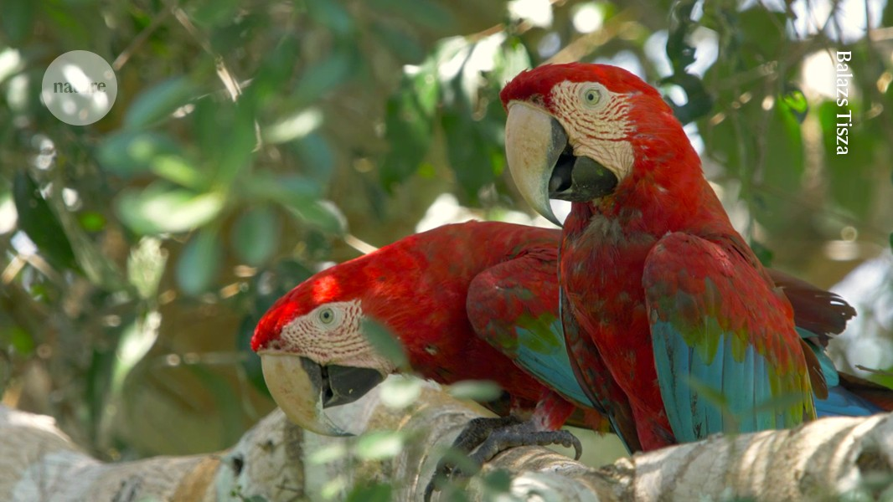

**📝 Abstract:**

> Nature, Published online: 10 March 2026;
> doi:10.1038/d41586-026-00765-9Ancient DNA and other clues from
> feathers found in modern Peru hint that the ancient Ychsma culture
> imported birds from the distant Amazon.

**📝 摘要概括:**

> 在现代秘鲁发现的羽毛的古DNA和其他线索暗示，古代伊奇马文化从遥远的亚马逊进口鸟类。

**🔍 解读点评:**

> 考古学与遗传学的结合揭示了前哥伦布时期南美洲的复杂贸易网络。研究者分析了秘鲁沿海遗址出土羽毛的古DNA，发现其中包含来自亚马逊热带雨林的鹦鹉物种。这意味着1000多年前，活生生的鹦鹉曾被运输跨越安第斯山脉——一段数百公里的艰难旅程。

🔗
[<u>https://doi.org/10.1038/d41586-026-00765-9</u>](https://doi.org/10.1038/d41586-026-00765-9)

────────────────────

## 46. Defining and identifying relevant stakeholders to advance effective conservation

*（定义和识别相关利益相关者以推进有效保护）*

**📰 Conservation Biology** \| Mon, 09 Ma *【Latest】*

Büscher, M., Przesdzink, F., Wilhelmy, C., ... Fiebelkorn, F. (2026).
Defining and identifying relevant stakeholders to advance effective
conservation. Conservation Biology, e70249.

**📝 摘要概括:**

> 研究探讨了如何定义和识别保护项目中的相关利益相关者，以提高保护行动的有效性和公平性。

**🔍 解读点评:**

> 保护项目的成败很大程度上取决于利益相关者的参与。但谁是利益相关者这一看似简单的问题实际上充满复杂性。这项研究提出了一个系统框架，帮助保护实践者识别那些受影响最大却常被忽视的群体。研究强调，真正有效的保护必须纳入当地社区和边缘化群体的声音。

🔗
[<u>https://conbio.onlinelibrary.wiley.com/doi/10.1111/cobi.70249</u>](https://conbio.onlinelibrary.wiley.com/doi/10.1111/cobi.70249)

────────────────────

# 【土壤与地球科学】

## 47. Detection of dietary stress and geophagic behaviour forced by dry seasons in Miocene Gomphotherium

*（中新世嵌齿象因干旱季节引发的饮食压力和食土行为检测）*

**📰 Biogeosciences** \| Tue, 10 Ma *【Latest】*

**📝 Abstract:**

> Detection of dietary stress and geophagic behaviour forced by dry
> seasons in Miocene Gomphotherium Rute Coimbra, Niels de Winter, Maria
> Ríos, Rui Bernardino, Darío Estraviz-López, Priscila Lohmann, Roberta
> Martino, Aurora Grandal-d'Anglade, Fernando Rocha, and Philippe Claeys
> Biogeosciences, 23, 1833–1858,
> https://doi.org/10.5194/bg-23-1833-2026, 2026 To understand human
> impact on climate and biodiversity, we studied fossil teeth of
> Gomphotherium from Miocene Portugal. Chemical patterns, like those in
> modern elephants, show seasonal diet changes and geophagy during dry
> periods. This suggests dry seasons shaped animal behavior and
> ecosystems, offering insights into how land life responded to past
> warming—and how it might react to future climate change.

**📝 摘要概括:**

> 为了理解人类对气候和生物多样性的影响，研究者分析了葡萄牙中新世嵌齿象的化石牙齿。化学模式显示季节性饮食变化和干旱期的食土行为。这表明干旱季节塑造了动物行为和生态系统。

**🔍 解读点评:**

> 研究团队通过分析1500万年前嵌齿象牙齿中的化学元素，发现这些古代巨兽会在干旱季节改变饮食并吃土以补充矿物质。这种行为模式与现代非洲象惊人相似，说明季节性气候压力是塑造大型哺乳动物行为的普遍因素。该发现为预测全球变暖背景下野生动物的适应策略提供了宝贵的古生态学参考。

🔗
[<u>https://doi.org/10.5194/bg-23-1833-2026</u>](https://doi.org/10.5194/bg-23-1833-2026)

────────────────────

## 48. Evaluating glycerol dialkyl glycerol tetraether (GDGT)-based reconstructions from varved lake sediments during the Holocene

*（评估全新世湖泊纹层沉积物中基于GDGT的古气候重建）*

**📰 Biogeosciences** \| Tue, 10 Ma *【Latest】*

**📝 Abstract:**

> Evaluating glycerol dialkyl glycerol tetraether (GDGT)-based
> reconstructions from varved lake sediments during the Holocene Ashley
> M. Abrook, Gordon N. Inglis, Peter G. Langdon, McKenzie R. Bentley,
> Achim Brauer, Ian Bull, Daisy Fallows, Paul Lincoln, Antti E. K.
> Ojala, Helen L. Whelton, and Celia Martin-Puertas Biogeosciences, 23,
> 1809–1832, https://doi.org/10.5194/bg-23-1809-2026, 2026 We present
> lipid-based environmental and temperature reconstructions spanning the
> Holocene from three European varved lakes. At each site archaea are
> impacted by methane which influence lake water temperature
> reconstructions, and bacteria appear to respond to oxygen conditions
> and specific lake and environmental processes. Nonetheless, bacterial
> temperature reconstructions are comparable to regional climat

**📝 摘要概括:**

> 研究者从三个欧洲纹层湖泊获得了横跨全新世的脂质古环境和温度重建结果。研究发现古菌受甲烷影响，影响湖水温度重建。

**🔍 解读点评:**

> 这项研究在古气候学领域具有重要方法论价值。GDGT生物标志物是重建过去温度的重要工具，但研究揭示了湖泊环境可能干扰温度信号的解读。通过对比三个欧洲湖泊的数据，研究者提出了改进的校正方案。

🔗
[<u>https://doi.org/10.5194/bg-23-1809-2026</u>](https://doi.org/10.5194/bg-23-1809-2026)

────────────────────

## 49. Species-specific differential dissolution morphology of selected coccolithophore species: an experimental study

*（颗石藻物种特异性差异溶解形态学：一项实验研究）*

**📰 Biogeosciences** \| Mon, 09 Ma *【Latest】*

Langer, G., Probert, I., Young, J. R., & Ziveri, P. (2026).
Species-specific differential dissolution morphology of selected
coccolithophore species: an experimental study. Biogeosciences, 23(5),
1795-1808.

**📝 Abstract:**

> Species-specific differential dissolution morphology of selected
> coccolithophore species: an experimental study Gerald Langer, Ian
> Probert, Jeremy R. Young, and Patrizia Ziveri Biogeosciences, 23,
> 1795–1808, https://doi.org/10.5194/bg-23-1795-2026, 2026
> Coccolithophores are important marine CaCO3 producers and their
> biominerals, the coccoliths, partly dissolve in the upper water column
> where dissolution is unexpected. Studying coccolith dissolution in
> field samples is hampered by a paucity of experimental studies
> describing dissolution morphologies. Here we fill this gap by
> experimentally dissolving different coccolithophores and applying our
> results to field samples.

**📝 摘要概括:**

> 颗石藻是重要的海洋碳酸钙生产者，其生物矿化产物颗石在上层水柱中部分溶解。这项研究通过实验溶解不同颗石藻并将结果应用于野外样品。

**🔍 解读点评:**

> 颗石藻是海洋碳循环的关键参与者，但我们对其碳酸钙外壳溶解过程的理解仍有限。这项实验研究详细记录了不同物种颗石的溶解特征——它们各有独特的溶解指纹。这些基准数据对于评估海洋酸化对颗石藻的影响至关重要。

🔗
[<u>https://doi.org/10.5194/bg-23-1795-2026</u>](https://doi.org/10.5194/bg-23-1795-2026)

────────────────────

## 50. Profile of Emily E. Brodsky

*（Emily E. Brodsky人物简介）*

**📰 PNAS** \| 2026-02-18 *【Latest】*

Davis, T. H. (2026). Profile of Emily E. Brodsky. Proceedings of the
National Academy of Sciences, 123(9), e2603284123.

**📝 Abstract:**

> To study the interplay of mechanical stress and strain in faults,
> seismologist Emily Brodsky looks for earthquakes with a known trigger,
> such as a volcano or injection of underground wastewater. These
> triggers help explain how a fault breaks. Brodsky ...

**📝 摘要概括:**

> 为研究断层中机械应力和应变的相互作用，地震学家Emily
> Brodsky寻找具有已知触发因素的地震，如火山或地下废水注入。

**🔍 解读点评:**

> PNAS的人物专栏介绍了地震学家Emily
> Brodsky的研究工作。她专注于诱发地震——由人类活动或自然过程触发的地震。通过研究废水注入、水库蓄水等已知触发源，她揭示了断层破裂的物理机制。在页岩气开采日益增多的今天，她的研究具有重要实用价值。

🔗
[<u>https://www.pnas.org/doi/abs/10.1073/pnas.2603284123</u>](https://www.pnas.org/doi/abs/10.1073/pnas.2603284123)

────────────────────

## 51. Effects of correlated collisions and intermittency on the growth of lucky droplets

*（相关碰撞和间歇性对幸运液滴生长的影响）*

**📰 PNAS** \| 2026-02-23 *【Latest】*

**📝 Abstract:**

> SignificanceGiven the complexity of precipitation in warm clouds,
> simple conceptual models are crucial for identifying key aspects of
> accelerated droplet growth. Statistical outliers with anomalously
> frequent collisions, so-called lucky droplets, are ...

**📝 摘要概括:**

> 鉴于暖云降水的复杂性，简单的概念模型对于识别加速液滴生长的关键因素至关重要。具有异常频繁碰撞的统计异常值——所谓的幸运液滴——是一个核心概念。

**🔍 解读点评:**

> 在温暖的云中，微小水滴如何迅速长大成雨滴一直是大气科学之谜。幸运液滴假说认为，少数统计上的幸运儿因偶然经历更多碰撞而快速增长，成为降水的种子。这项研究深入探讨了碰撞的时空相关性如何影响这一过程。

🔗
[<u>https://www.pnas.org/doi/abs/10.1073/pnas.2502553123</u>](https://www.pnas.org/doi/abs/10.1073/pnas.2502553123)

────────────────────

## 52. Microbial dispersal from a hyperactive sandsheet in the Icelandic Highland

*（来自冰岛高地活跃沙席的微生物扩散）*

**📰 Science of the Total Environment** *【Latest】*

**📝 Abstract:**

> Publication date: 15 April 2026Source: Science of The Total
> Environment, Volume 1025Author(s): Nathan Hadland, Christopher W.
> Hamilton, Peter Schroedl, Federica Calabrese, Jeffery Marlow, Solange
> Duhamel

**📝 摘要概括:**

> 研究调查了冰岛高地沙席向大气释放微生物的过程及其影响范围。

**🔍 解读点评:**

> 冰岛的火山沙漠是地球上最活跃的沙尘源区之一。这项研究首次追踪了随沙尘传播的微生物——它们可以被风携带数百公里。研究发现这些空中旅客在新环境中可能存活并建立种群。这一发现对于理解极端环境中的生命传播具有重要意义。

🔗
[<u>https://www.sciencedirect.com/science/article/pii/S0048969726003207</u>](https://www.sciencedirect.com/science/article/pii/S0048969726003207)

────────────────────

## 53. Generation of inner core anisotropy by anisotropic thermal conductivity of iron crystals

*（铁晶体各向异性热导率产生内核各向异性）*

**📰 Nature Geoscience** \| 2026-03-05 *【Latest】*

Das, P. P., Buffett, B., & Frost, D. (2026). Generation of inner core
anisotropy by anisotropic thermal conductivity of iron crystals. Nature
Geoscience.

**📝 Abstract:**

> Nature Geoscience, Published online: 05 March 2026;
> doi:10.1038/s41561-026-01916-3Seismic wave velocity variations, or
> anisotropy, in the Earth’s inner core may be generated by the
> differing thermal conductivity of iron crystals along their long and
> short crystallographic axes, according to coupled thermo-mechanical
> modelling.

**📝 摘要概括:**

> 地球内核中地震波速度的变化可能是由铁晶体沿其长短结晶轴的不同热导率产生的，这是基于热-力耦合模型的结论。

**🔍 解读点评:**

> 地球内核的地震波各向异性是地球物理学的长期谜题。这项研究提出了一个优雅的解释：铁晶体本身就具有方向依赖的热导率，这会导致晶体沿特定方向优先生长和排列。模型结果与观测到的各向异性模式吻合良好。

🔗
[<u>https://doi.org/10.1038/s41561-026-01916-3</u>](https://doi.org/10.1038/s41561-026-01916-3)

────────────────────

## 54. Mantle oxidation influenced by reduction-oxidation budget of Mariana-type subduction zones

*（马里亚纳型俯冲带的氧化还原收支影响地幔氧化）*

**📰 Nature Geoscience** \| 2026-03-04 *【Latest】*

Duan, W., Connolly, J. A. D., van Keken, P. E., ... Li, S. (2026).
Mantle oxidation influenced by reduction-oxidation budget of
Mariana-type subduction zones. Nature Geoscience.

**📝 Abstract:**

> Nature Geoscience, Published online: 04 March 2026;
> doi:10.1038/s41561-026-01939-wMariana-type subduction redox is
> controlled by sulfide oxidation that enables fluids to carry redox
> budgets from the slab to the mantle wedge, and iron-rich slab sediment
> melts that oxidize the back-arc mantle, according to a 2D
> thermomechanical–thermodynamic model.

**📝 摘要概括:**

> 马里亚纳型俯冲的氧化还原受硫化物氧化控制，使流体能够将氧化还原收支从板片传递到地幔楔；而富铁板片沉积物熔体则氧化弧后地幔。

**🔍 解读点评:**

> 俯冲带是地球物质循环的枢纽。这项研究通过数值模拟揭示了俯冲过程中氧化还原反应如何重塑地幔的化学性质。关键发现是硫化物的氧化和沉积物熔融这两个过程共同控制了地幔的氧化状态。这对理解俯冲带火山活动和地幔演化都有重要意义。

🔗
[<u>https://doi.org/10.1038/s41561-026-01939-w</u>](https://doi.org/10.1038/s41561-026-01939-w)

────────────────────

# 【进化与动物生态】

## 55. Time-dependent adaptations of damaged neurons and their microenvironment in the regenerating adult zebrafish spinal cord

*（成年斑马鱼脊髓再生中受损神经元及其微环境的时序适应）*

**📰 Science Advances** \| 2026-03-06 *【Latest】*

Lafouasse, L., Koutsogiannis, K., Dai, Y. E., ... Ampatzis, K. (2026).
Time-dependent adaptations of damaged neurons and their microenvironment
in the regenerating adult zebrafish spinal cord. Science Advances,
12(10), eaea2882.

**📝 摘要概括:**

> 研究揭示了斑马鱼脊髓损伤后神经元及周围微环境随时间变化的适应性响应机制。

**🔍 解读点评:**

> 斑马鱼具有令人惊叹的脊髓再生能力，而哺乳动物则缺乏这种能力。这项研究详细刻画了斑马鱼脊髓损伤后的再生时间线，揭示了受损神经元如何与周围的支持细胞协同工作实现功能恢复。这些发现可能为人类脊髓损伤治疗提供新的策略。

🔗
[<u>https://doi.org/10.1126/sciadv.aea2882</u>](https://doi.org/10.1126/sciadv.aea2882)

────────────────────

## 56. Cis-regulatory evolution reveals sensory trade-offs as a genetic basis for temporal niche evolution in tapirs

*（貘的顺式调控进化揭示感官权衡是时间生态位进化的遗传基础）*

**📰 Science Advances** \| 2026-03-04 *【Latest】*

Zhou, X., Pan, D., Zhou, J., ... Chen, L. (2026). Cis-regulatory
evolution reveals sensory trade-offs as a genetic basis for temporal
niche evolution in tapirs. Science Advances, 12(10), eadz4758.

**📝 摘要概括:**

> 研究揭示了貘从日行性向夜行性转变过程中，视觉和嗅觉相关基因的调控变化，展示了感官系统间的进化权衡。

**🔍 解读点评:**

> 貘是研究昼夜节律进化的理想模型。这项研究发现，当貘的祖先从白天活动转向夜间活动时，其基因调控发生了有趣的变化：视觉基因活性降低，而嗅觉基因增强。这种感官此消彼长的现象在分子水平上首次被清晰记录。

🔗
[<u>https://doi.org/10.1126/sciadv.adz4758</u>](https://doi.org/10.1126/sciadv.adz4758)

────────────────────

## 57. Uniqueness and predictability in evolution and the history of mollusks

*（软体动物进化和历史中的独特性与可预测性）*

**📰 PNAS** \| 2026-02-23 *【Latest】*

Vermeij, G. J., & Thomson, T. J. (2026). Uniqueness and predictability
in evolution and the history of mollusks. Proceedings of the National
Academy of Sciences, 123(9), e2520986123.

**📝 Abstract:**

> SignificanceUnique phenomena are important in history but are
> difficult to study because they resist categorization and are
> therefore unpredictable. To examine the timing and circumstances of
> unique evolutionary events, we identified traits that evolved ...

**📝 摘要概括:**

> 独特现象在历史中很重要，但由于难以分类和不可预测而难以研究。为了研究独特进化事件的时机和环境，我们识别了仅进化一次的性状。

**🔍 解读点评:**

> 进化历史充满独一无二的事件——比如贝壳的起源、章鱼的智能。这项研究系统分析了软体动物中那些只发生过一次的进化创新，探讨了独特性与环境条件的关系。研究发现某些独特性状的出现与特定的环境压力相关。

🔗
[<u>https://www.pnas.org/doi/abs/10.1073/pnas.2520986123</u>](https://www.pnas.org/doi/abs/10.1073/pnas.2520986123)

────────────────────

## 58. Repeated convergent evolution of bradykinin mimics as defensive toxins

*（缓激肽模拟物作为防御毒素的反复趋同进化）*

**📰 Science** \| 2026-03-05 *【Latest】*

Shi, N., Touchard, A., Schendel, V., ... Robinson, S. D. (2026).
Repeated convergent evolution of bradykinin mimics as defensive toxins.
Science, 391(6789), 1046-1052.

**📝 Abstract:**

> Science, Volume 391, Issue 6789, Page 1046-1052, March 2026.

**📝 摘要概括:**

> 研究发现多个不相关的动物类群独立进化出了模拟缓激肽的防御毒素，展示了趋同进化的普遍性。

**🔍 解读点评:**

> Science这篇论文揭示了自然界的一个惊人模式：从蝎子到蛇，从蜘蛛到蜜蜂，许多不相关的动物都发明了相似的毒素分子——它们模拟猎物体内的缓激肽信号分子，造成剧烈疼痛。这种趋同进化表明，利用宿主自身的分子通路是一种高效的防御策略。

🔗
[<u>https://doi.org/10.1126/science.adx0452</u>](https://doi.org/10.1126/science.adx0452)

────────────────────

## 59. Could flies sniff out contraband chemicals?

*（果蝇能否嗅出违禁化学品）*

**📰 Nature** \| 2026-03-10 *【Latest】*

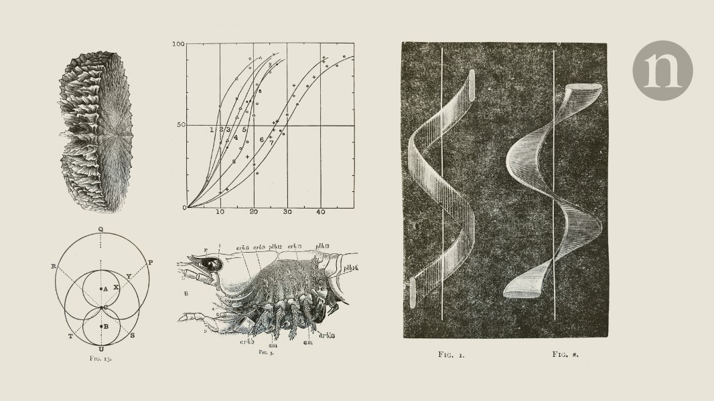

**📝 Abstract:**

> Nature, Published online: 10 March 2026;
> doi:10.1038/d41586-026-00642-5A suggestion that mutant insects could
> detect narcotics or explosive substances, and how ash seeds feature a
> screw propeller, in this week’s pick from the Nature archive.

**📝 摘要概括:**

> 有人提出突变昆虫可以检测毒品或爆炸物，以及白蜡树种子如何具有螺旋桨特性——本周Nature档案精选。

**🔍 解读点评:**

> 这是Nature档案回顾栏目的文章。果蝇的嗅觉系统经过遗传改造后，理论上可以检测各种化学物质，包括毒品和炸药。虽然这个想法听起来像科幻小说，但基于对果蝇嗅觉受体的深入理解，已经在实验室取得了初步进展。

🔗
[<u>https://doi.org/10.1038/d41586-026-00642-5</u>](https://doi.org/10.1038/d41586-026-00642-5)

────────────────────

## 60. The role of amygdala GABA neurons in controlling stress and reproduction in female mice

*（杏仁核GABA神经元在调控雌性小鼠应激和繁殖中的作用）*

**📰 Nature Communications** \| 2026-03-10 *【Latest】*

**📝 Abstract:**

> Nature Communications, Published online: 10 March 2026;
> doi:10.1038/s41467-026-70364-9How acute stress activates amygdala
> inhibitory circuits that regulate reproduction remains elusive. Here,
> the authors uncover a neural tug-of-war between functionally distinct
> GABA neuronal populations in the posterodorsal medial amygdala that
> translate stress signals into changes in reproductive hormone rhythms
> in female mice.

**📝 摘要概括:**

> 急性应激如何激活调节繁殖的杏仁核抑制性回路仍不清楚。研究揭示了后内侧杏仁核中功能不同的GABA神经元群体之间的神经拔河，将应激信号转化为生殖激素节律的变化。

**🔍 解读点评:**

> 压力是如何影响生育能力的？这项神经科学研究在分子和神经环路层面给出了答案。研究发现大脑杏仁核中存在两群功能相反的GABA神经元——它们像拔河一样控制着应激信号向生殖系统的传递。这一发现为理解压力相关的生育障碍提供了神经机制基础。

🔗
[<u>https://doi.org/10.1038/s41467-026-70364-9</u>](https://doi.org/10.1038/s41467-026-70364-9)

────────────────────
